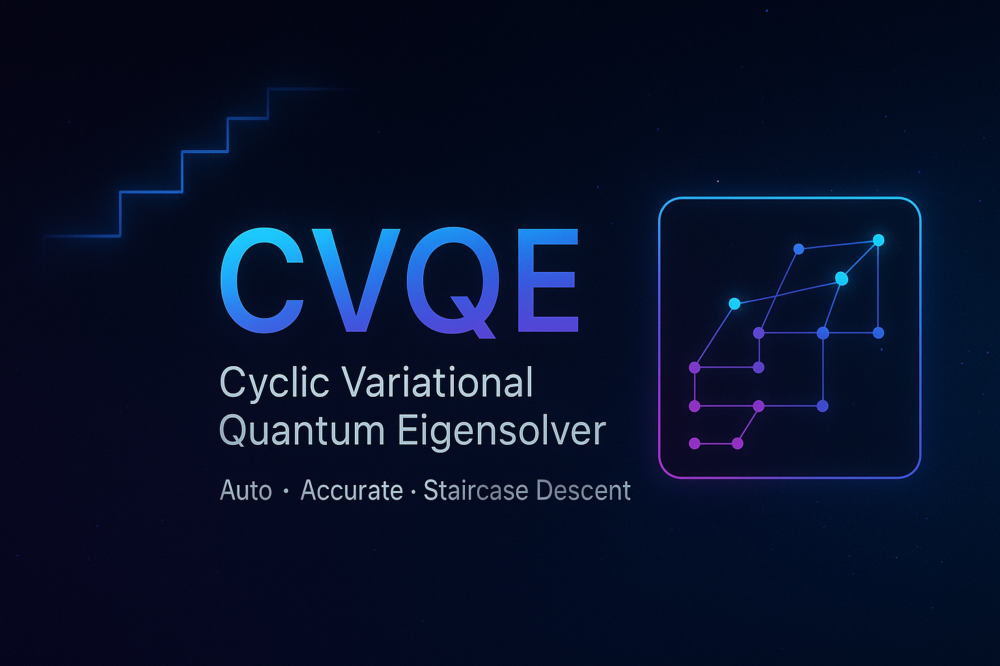

  

# Cyclic Variational Quantum Eigensolver (CVQE) 🚀

**Cyclic Variational Quantum Eigensolver (CVQE)** is a hardware-efficient framework for accurate ground-state quantum simulation on noisy intermediate-scale quantum (NISQ) devices.  
📄 [arXiv 2509.13096](https://arxiv.org/abs/2509.13096)

CVQE introduces a measurement-driven feedback cycle: important Slater determinants are iteratively added to the reference superposition, while a fixed entangler (e.g., single-layer UCCSD) is reused throughout.  
This adaptive scheme enables CVQE to:

---

#### 💡 Escape barren plateaus via staircase-like descent
Instead of performing a costly search of operators, CVQE grows its variational space automatically with measurement-driven feedback cycle.
Each time new high-probability Slater determinants are added and the optimizer reexplore the landscape, the optimization discovers a **sharp energy drop**, forming a visible “staircase” trajectory that bypasses barren plateaus and local minima.

---

#### 💡 Maintain chemical accuracy across correlation regimes
From weakly to strongly correlated systems, CVQE consistently reaches **chemical-precision accuracy** with a single fixed entangler.  
It unifies the treatment of diverse systems under one stable, automated workflow.

---

#### 💡 Achieve favorable accuracy–cost trade-offs vs selected CI (e.g., SHCI)
CVQE reuses a fixed UCCSD-like entangler and limits the reference to a small number of high-impact determinants.  
This yields accuracy comparable to selected CI methods like SHCI while using **fewer determinants** — a strong advantage for NISQ devices with limited resources.

---

### 📘 Paper:
Zhang, H., & Asthana, A. (2025).  
*Cyclic Variational Quantum Eigensolver: Escaping Barren Plateaus through Staircase Descent.*  
arXiv: [2509.13096](https://arxiv.org/abs/2509.13096)

---
